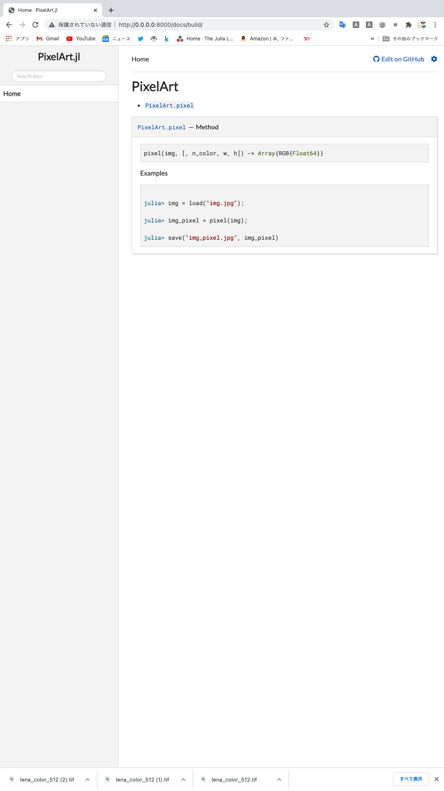

この記事では、モジュールやパッケージ関連の操作がわかることを前提として、

公式パッケージ化のために

- PkgTemplates.jlを用いて雛形作り
- パッケージ開発の基本中の基本とTravis CIによる自動テスト
- DocStringとDocumentar.jlを使ったドキュメント作り
- 登録

の4つを順に解説してパッケージを作っていきます。


# PkgTemplates.jlを用いた雛形づくり

さて、パッケージを作ると言っても具体的にどのように手をつければ良いかわからないと思います。

そこで役に立つのがPkgTemplates.jlです。

このパッケージはJuliaでPackageを作るための雛形を自動で生成してくれます。

```julia

(@v1.5) pkg> add PkgTemplates

julia> using PkgTemplates

julia> t = Template(;
         user="abap34",  # GitHubのuser名
         license="MIT",  
         authors=["Yuchi Yamaguhci"], 
         dir=".",      # 生成するディレクトリ
         julia_version=v"1.5",
         plugins=[     # 使うplugin. 公式登録にはtravisとdocumentが必須らしいです
         TravisCI(),
         Documenter(),
         GitHubPages()
       ],

```

さて、このようにしてTemplateの設定を済ませて、

```julia

julia> generate("PixelArt.jl", t)
[ Info: Running prehooks
[ Info: Running hooks
 Activating environment at `~/Desktop/PixelArt/Project.toml`
<中略>
[ Info: Running posthooks
[ Info: New package is at /Users/yuchi_ymgc/Desktop/PixelArt
```

とすることで、雛形を生成することができます。

確認してみます。


```
shell> cd PixelArt/
/Users/yuchi_ymgc/Desktop/PixelArt

shell> tree
.
├── LICENSE
├── Manifest.toml
├── Project.toml
├── README.md
├── docs
│   ├── Manifest.toml
│   ├── Project.toml
│   ├── make.jl
│   └── src
│       └── index.md
├── src
│   └── PixelArt.jl
└── test
    └── runtests.jl
```


今回は前回作った [画像をdot絵にするやつ](https://abap34.github.io/my-website/julialang/image/ml/2021/01/29/dot-art.html)　をパッケージにしていきます。

これからコードを動かすためにPixelArt.jlをJuliaに認識してもらいます。

```julia
shell> pwd
/Users/yuchi_ymgc/Desktop/PixelArt

(@v1.5) pkg> dev .
[ Info: Resolving package identifier `.` as a directory at `~/Desktop/PixelArt`.
Path `.` exists and looks like the correct package. Using existing path.
  Resolving package versions...
Updating `~/.julia/environments/v1.5/Project.toml`
  [0ba03b52] + PixelArt v0.1.0 `../../../Desktop/PixelArt`
Updating `~/.julia/environments/v1.5/Manifest.toml`
  [0ba03b52] + PixelArt v0.1.0 `../../../Desktop/PixelArt`
```

また、PixelArt.jlはImages.jlに依存しているので追加しておきます。

このようにactivateした環境でパッケージを追加することで、自動的にProject.tomlが更新されます。(そのほかにも適宜必要なパッケージを追加しておきます。)

```julia
(@v1.5) pkg> activate .
 Activating environment at `~/Desktop/PixelArt/Project.toml`

(PixelArt) pkg> add Images
```


# パッケージ開発の基本中の基本


さて、パッケージの設計技法などに深く言及するのではなく、一般的なパッケージ開発のやり方について少しだけ言及します。


## ファイル構成
まず, 
src/PixelArt.jlは主に、

- 他のfileをincludeなどで取り込んで、exportする

という用途で使われ、基本的にその関数は
src/ 以下のファイル群に書かれていることが多いと思います。

なので具体的には以下のようになっており、本質的なコード量は少なめという印象があります。


```julia
# src/PixelArt.jl

module PixelArt

include("functions.jl")

export pixel

end
```

```julia
# src/functions.jl

function img_to_arr(img)
    return convert(Array{Float64}, channelview(img))
end

function pixel(img; n_color=5, w=64, h=64)
    img = imresize(img, (w, h))
    img = reshape(img_to_arr(img), (3, :))
    color_class = kmeans(img, n_color)
    img = hcat((x -> color_class.centers[:, x]).(color_class.assignments)...)
    return convert(Array{RGB{Float64}}, colorview(RGB, reshape(img, (3, w, h))))
end
```


このくらいの規模感では恩恵はほとんどないですが、ある程度以上の規模のパッケージではこのような構成を取らないと大変なことになります....


次に、test/runtest.jlです。


```julia
using PixelArt
using Test

@testset "PixelArt.jl" begin
    # Write your tests here.
end
```


デフォルトでは次のような形になっていて、それぞれの@testsetでテストを書くことができます。

そしてtravis ciなどを用いてテストおこないます。

もちろんローカルでも実行できるので、試してみます。


```julia
#test/runtests.jl
using PixelArt
using Test

@testset "Sugoi-Test" begin
    @test 1 + 1 == 2
    @test 2 + 2 == 4
end


@testset "Nice-Test" begin
    @test 1 + 1 == "田んぼの田"
end
```


```julia
julia> include("test/runtests.jl")
Test Summary: | Pass  Total
Sugoi-Test    |    2      2
Nice-Test: Test Failed at /Users/yuchi_ymgc/Desktop/PixelArt/test/runtests.jl:11
  Expression: 1 + 1 == "田んぼの田"
   Evaluated: 2 == "田んぼの田"
Stacktrace:
 [1] top-level scope at /Users/yuchi_ymgc/Desktop/PixelArt/test/runtests.jl:11
 [2] top-level scope at /Users/julia/buildbot/worker/package_macos64/build/usr/share/julia/stdlib/v1.5/Test/src/Test.jl:1115
 [3] top-level scope at /Users/yuchi_ymgc/Desktop/PixelArt/test/runtests.jl:11
Test Summary: | Fail  Total
Nice-Test     |    1      1
ERROR: LoadError: Some tests did not pass: 0 passed, 1 failed, 0 errored, 0 broken.
in expression starting at /Users/yuchi_ymgc/Desktop/PixelArt/test/runtests.jl:10
```

1 + 1は、田んぼの田ではないようです。(かなしい)

このように、@testsetを一つの単位としてテストを実行することができます。

また、PkgTemplates.jlでgenerateするときにTravis CIをpluginとして導入していたので、自動で.travis.ymlが生成されて、travisを有効化することで、test/runtests.jl は自動で実行されます。

一応今回は
- pixel()がちゃんと配列を返すのか
- nothingが来た場合ちゃんとエラーを吐くか
  
  

をチェックしておきます。(本当はもっとちゃんと書こうね！)


(追記: `@test_throwns HogeError f(x)`　は、f(x)がHogeErrorを投げるかどうかをテストします。)

```julia
# test/runtests.jl
using PixelArt
using Test
using TestImages

@testset "PixelArt.jl" begin
    img = testimage("l")
    @test typeof(pixel(img)) <: AbstractArray 
    # A wrong path often causes passing nothing.
    @test_throws MethodError pixel(nothing) 
end
```

## Revise.jl

さて、ここまでファイル構成に関して解説していましたが、ここでJuliaのパッケージ開発において、もはや必須と言ってもいいパッケージ、Revise.jlを紹介します。

Revise.jlは、 REPLで`using Revise`した状態でパッケージを読み込むと自動で更新を検知してくれるパッケージです。

パッと言われても「..?」という感じだと思うので、

実際に確認してみましょう。

PixelArt.jlに次のような関数, `hello` を追加してexportしておきます。


```julia
function hello()
    println("Hello!")
end
```


この状態で、REPLを起動し、ReviseとPixelArt.jlを読み込みます。

```julia
julia> using Revise

julia> using PixelArt
```

先ほど追加したhello()を使ってみます。

```julia
julia> hello()
Hello!
```

ここで、このhello()を更新してみます。

通常ならばこの変更はusingされた後ですから反映されません。

```julia
function hello()
    println("Hi!")
end
```

しかし、Revise.jlを用いることで、

```julia
julia> hello()
Hi!
```


なんと、REPL上で何も操作をせずに更新された関数を使うことができました。


このようにして逐次的に結果を確認しながら開発をすることができます。

いちいちREPLを再起動したり `julia hoge.jl` するのは非効率なので、Revise.jlの強力さがわかると思います。


# DocStringとDocumentar.jlを使ったドキュメント作り


## docstring
さて、パッケージの中身ができても他の人に使ってもらうには, ドキュメントを作る必要があります。

が、一般に、これはとてもめんどくさいです。

しかし、Juliaでは面倒なドキュメントの構築をとても簡単に行える方法が用意されています。

まず最初は、`docstring`と呼ばれる機能です。

これは、関数や構造体などにmarkdown形式で書かれたコメントをつけることで、ドキュメントをつけることができ、ユーザーはREPLなどの対話的環境で、

`?foo` などとすることで閲覧できます。

(例:?sort　の結果)

```julia
help?> sort
search: sort sort! sortperm sortperm! sortslices Cshort issorted QuickSort MergeSort Cushort partialsort partialsort!

  sort(v; alg::Algorithm=defalg(v), lt=isless, by=identity, rev::Bool=false, order::Ordering=Forward)

  Variant of sort! that returns a sorted copy of v leaving v itself unmodified.

  Examples
  ≡≡≡≡≡≡≡≡≡≡

  julia> v = [3, 1, 2];
  
  julia> sort(v)
  3-element Array{Int64,1}:
   1
   2
   3
  
  julia> v
  3-element Array{Int64,1}:
   3
   1
   2

  ────────────────────────────────────────────────────────────────────────────────────────────────────────────────────────────────

  sort(A; dims::Integer, alg::Algorithm=DEFAULT_UNSTABLE, lt=isless, by=identity, rev::Bool=false, order::Ordering=Forward)

  Sort a multidimensional array A along the given dimension. See sort! for a description of possible keyword arguments.

  To sort slices of an array, refer to sortslices.

  Examples
  ≡≡≡≡≡≡≡≡≡≡

  julia> A = [4 3; 1 2]
  2×2 Array{Int64,2}:
   4  3
   1  2
  
  julia> sort(A, dims = 1)
  2×2 Array{Int64,2}:
   1  2
   4  3
  
  julia> sort(A, dims = 2)
  2×2 Array{Int64,2}:
   3  4
   1  2
```

さて、このdocstringは厳密に定義されているわけではないですが、大体次のようなルールで書かれるようです。

- 最初に関数名と引数、帰り値を書く(このとき、省略可能な引数は[]で囲う。)
```julia
f(hoge, [, huga, huge])
```

- 引数が多いときはその説明を追記する。

```
# Arguments
- `hoge`: the hoge param.
- `huga`: the huga param.
- `huge`: the huge param.
```

- 実行例を書く。

````julia
# Examples

​```jldoctest

julia> f("huga")
"hugahuga"
```
````

ここまでを連結して書くと以下のような感じ。


````julia
"""
    f(hoge, [, huga, huge])

# Arguments
- `hoge`: the hoge param.
- `huga`: the huga param.
- `huge`: the huge param.
# Examples

​```jldoctest

julia> f("huga")
"hugahuga"
```
function f(hoge; huga=1, huga=2)
    # なんかの処理
end
````


ここで実行例の先頭に`jldoctest`と書いてありますが、

これを追記することでのちにドキュメントを生成するときに自動でテストを行ってくれます。


ちなみにpixel()には次のようなdocstringをつけてみました。


````
"""
    pixel(img, [, n_color, w, h]) -> Array{RGB{Float64}}

# Examples

```jldoctest
julia> using PixelArt

julia> using Images

julia> img = load("img.jpg");

julia> img_pixel = pixel(img);

julia> save("img_pixel.jpg", img_pixel)
```
"""
function pixel(img::AbstractArray; n_color=5, w=64, h=64) 
    img = imresize(img, (w, h))
    img = reshape(img_to_arr(img), (3, :))
    color_class = kmeans(img, n_color)
    img = hcat((x -> color_class.centers[:, x]).(color_class.assignments)...)
    return convert(Array{RGB{Float64}}, colorview(RGB, reshape(img, (3, w, h))))
end

````


## Documenter.jl

Documenter.jlは、docstringから自動でドキュメントを生成してくれるパッケージです。

PkgTemplates.jlで生成した場合、自動でdocs/make.jlが生成されるので、それを実行しましょう。


```julia
# docs/make.jl

using PixelArt
using Documenter

makedocs(;
    modules=[PixelArt],
    authors="Yuchi Yamaguchi",
    repo="https://github.com/abap34/PixelArt.jl/blob/{commit}{path}#L{line}",
    sitename="PixelArt.jl",
    format=Documenter.HTML(;
        prettyurls=get(ENV, "CI", "false") == "true",
        canonical="https://abap34.github.io/PixelArt.jl",
        assets=String[],
    ),
    pages=[
        "Home" => "index.md",
    ],
)

deploydocs(;
    repo="github.com/abap34/PixelArt.jl",
)
```




すると、このように自動で構築されます！便利。


また、これとは別にREADME.mdを書いておきましょう。

これがないとなんのパッケージなのか最初はわからなくなってしまいます。

# 登録

さて、ここまでで構築、テスト、documentとやってきましたが最後にこれを公式のパッケージとして登録します。

※ 一応、ここまでの結果をGitHubなどにアップロードすることで非公式(いわゆる野良パッケージ)として使えます。

もしも公式パッケージにする場合は、まずProject.tomlを編集する必要があります。

Project.tomlの[compat]は、PkgTemplateでは `julia="1"` のみ生成されていますが、追加されたパッケージについても書く必要があります。

([compat]は動作保証をするパッケージのバージョンを列挙する項目です。)

今回は、以下のようにしました。


```toml
[compat]
julia = "1.5"
Clustering = "0.14"
Documenter = "0.24"
ImageMagick = "1.1"
Images  = "0.22"
QuartzImageIO  = "0.6"
TestImages  = "1.0"
```

さて、Project.tomlを更新したら早速登録しましょう。

公式パッケージにするためには https://github.com/JuliaRegistries/General　にPRをする必要がありますが、

自分で書くわけではなく基本的に自動で生成します。

おそらく最も敷居が低いのはJuliaHubから申請する方法です。

https://juliahub.com　

にログインして、Contribute > Register Packagesを選択して、


- パッケージのGitHubレポジトリのURL
- パッケージの名前
- 開発者(もしくはグループ)の名前
etc...

を入力しています。

今回の場合は、以下のようになりました。

)

そしてSubmitを押すと、自動的にプルリクエストが作られます。


)


また、[Registrator.jl](https://github.com/JuliaRegistries/Registrator.jl?installation_id=14442588&setup_action=install#how-to-use)を利用する方法もあります。

[README.mdのInstall部分](https://github.com/JuliaRegistries/Registrator.jl?installation_id=14442588&setup_action=install#install-registrator)　からインストールして、登録したいパッケージのレポジトリにissueを立て,

`@JuliaRegistrator register` とコメントすることで自動でPRを立ててくれます。

実は最初のPRでProject.tomlに[compat]を追加するのを忘れてしまって更新する必要があったのですが、この方法だと何度も更新して一発で申請できるので不安な場合はこちらの方がいいかもしれないです。


)

全てのCIを通過して3日たつと自動でマージされます！仮に何かしら引っかかった場合は修正して再度`@JuliaRegistrator register` をしましょう。

通過しなかったPRを自動で修正してくれます。(つまりPRを取り下げる必要はありません)


#　kekka

{マージされたら書きます！}
